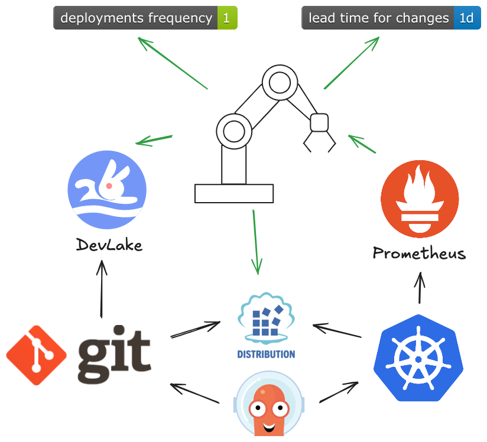

# Handler Project

Handler tracks images reaching deployment environments and reports those events to devlake. This allows seamless repoting on dora metics.

## Project Structure

- `cmd/` - Main application entry point(s)
  - `root.go` - Primary command logic
- `integrations/` - Integrations with external services
  - `crane.go` - Crane integration
  - `prometheus.go` - Prometheus metrics integration
- `logic/` - Core business logic (currently empty)
- `model/` - Data models and configuration
  - `config.go` - Configuration structures
  - `data.go` - Data types
- `routing/` - Routing logic
  - `devlake.go` - DevLake routing
  

## Getting Started

### Prerequisites
- Go 1.20 or newer

### Installation
1. Clone the repository:
   ```bash
   git clone <repository-url>
   cd handler
   ```
2. Install dependencies:
   ```bash
   go mod download
   ```

### Running Locally
To start the server:
```bash
go run main.go
```

## License
See [LICENSE](LICENSE) for details.

---
*Generated on 2025-05-17*
